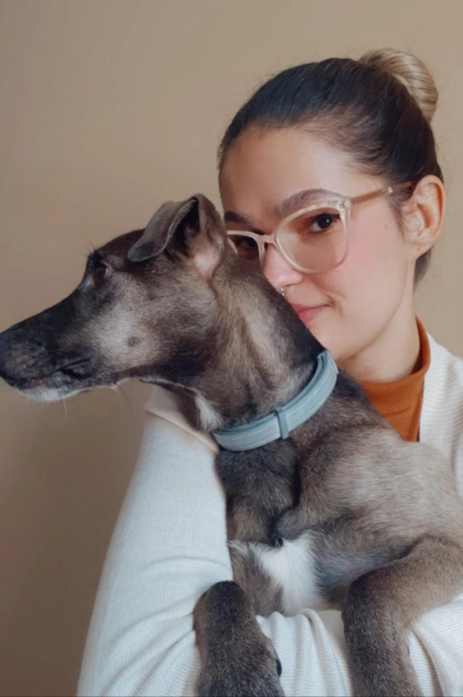

<h1 align="center">Hello World , It´s me Patricia Martins
 </h1>

  

## About me
- 👩‍💻 Front-End Developer.
- 📍 I am from Sao Paulo - Brazil.
- 💗 I am a dog person.
 

### I graduated in system analysis and worked for two years as a software developer, but I have always been interested in the design field. I was searching for a design course, and I found Interactive Media design, where I could improve my skills as a software developer and learn about design.

 

 
🖥️ HTML | CSS | JavaScript | Angular

